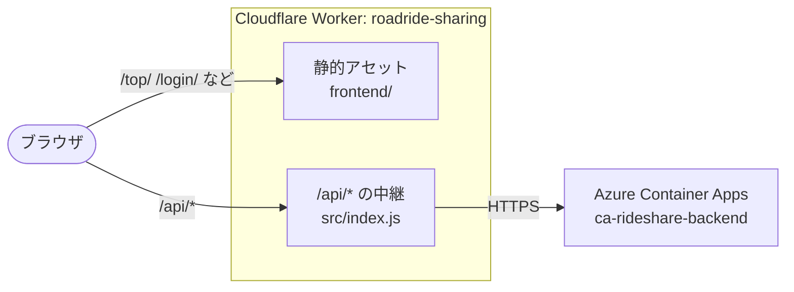

# フロントエンドの配信（Cloudflare Workers）

`frontend/` の静的ファイルを Cloudflare Workers で配信し、`/api/*` だけを Azure のバックエンドへ中継します。
`main` にマージされると GitHub Actions（`.github/workflows/deploy-frontend.yml`）が自動でデプロイします。

## 構成



- フロントエンドは API を同じオリジンの `/api` で呼ぶため、ブラウザから見て **CORS は不要**です
- `/` は `frontend/_redirects` で `/top/` にリダイレクトします
- `html_handling` は `auto-trailing-slash` です。`/login/index.html` は `/login/`、`/reservation/pages/reservation.html` は `/reservation/pages/reservation` に 307 でリダイレクトされます（クエリ文字列は残ります）
- 中継先は `wrangler.jsonc` の `vars.BACKEND_ORIGIN` です。Cookie と Cloudflare 固有のヘッダーはバックエンドに渡しません

| ファイル | 内容 |
| --- | --- |
| `wrangler.jsonc` | Worker の設定（静的アセットのディレクトリ、`/api/*` だけ Worker で処理する `run_worker_first`、中継先） |
| `src/index.js` | `/api/*` をバックエンドへ中継する処理 |
| `package.json` | wrangler のバージョンを固定（4.141.0） |
| `../frontend/_redirects` | `/` → `/top/` のリダイレクト |

## 初回セットアップ（GitHub の Secrets）

GitHub Actions からデプロイするため、リポジトリの Secrets に次の 2 つを登録します（Settings →「Secrets and variables」→「Actions」）。

| Secret | 取得方法 |
| --- | --- |
| `CLOUDFLARE_API_TOKEN` | Cloudflare ダッシュボード →「My Profile」→「API Tokens」→「Create Token」→ テンプレート「**Edit Cloudflare Workers**」で作成 |
| `CLOUDFLARE_ACCOUNT_ID` | Cloudflare ダッシュボードの「Workers & Pages」の右側、または `npx wrangler whoami` で表示される Account ID |

登録後、`main` にマージするか、Actions タブから「フロントエンドを Cloudflare にデプロイ」を手動実行（workflow_dispatch）するとデプロイされます。
デプロイ先の URL は `https://roadride-sharing.<アカウントのサブドメイン>.workers.dev` です（Actions のログに表示されます）。

## デプロイの流れ

| きっかけ | 動作 |
| --- | --- |
| `main` への push（`frontend/`・`cloudflare/`・ワークフローに変更あり） | `wrangler deploy` で本番にデプロイ |
| PR | `wrangler deploy --dry-run` で設定とパッケージングだけ確認（Secrets は不要） |
| 手動実行 | `wrangler deploy` |

## ローカルで動かす

```sh
cd cloudflare
npm ci
cp .dev.vars.example .dev.vars   # 中継先をローカルのバックエンド（http://localhost:8080）にする
npm run dev                       # http://localhost:8787
```

`.dev.vars` がなければ、本番のバックエンドに中継されます。

## 手動でデプロイする

```sh
cd cloudflare
npx wrangler login
npm run check    # dry-run
npm run deploy
```
