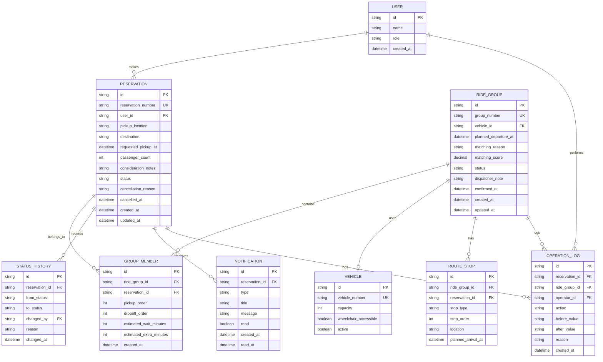
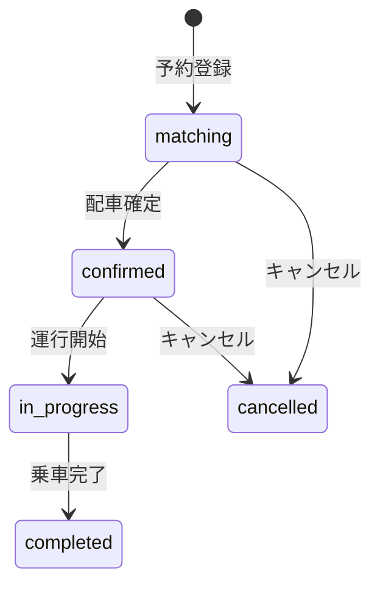

# データモデル定義

## 1. 方針

MVPでは、予約を中心に乗合グループと配車情報を関連付ける。利用者や配車担当者の認証機能は後回しにし、利用者識別子・担当者識別子は外部認証や仮ユーザーを参照できる形式にする。

## 2. ER図

## 3. エンティティ定義

### 3.1 users: 利用者・配車担当者

| 項目 | 型 | 制約 | 説明 |
| --- | --- | --- | --- |
| `id` | string | PK | ユーザー識別子 |
| `name` | string | 必須 | 表示名または予約名 |
| `role` | string | 必須 | `rider` または `dispatcher` |
| `created_at` | datetime | 必須 | 作成日時 |

### 3.2 reservations: 予約

| 項目 | 型 | 制約 | 説明 |
| --- | --- | --- | --- |
| `id` | string | PK | 予約内部ID |
| `reservation_number` | string | UNIQUE、必須 | 利用者へ表示する予約番号 |
| `user_id` | string | FK、必須 | `users.id` |
| `pickup_location` | string | 必須 | 乗車場所 |
| `destination` | string | 必須 | 目的地 |
| `requested_pickup_at` | datetime | 必須 | 希望乗車日時 |
| `passenger_count` | integer | 1以上、必須 | 乗車人数 |
| `consideration_notes` | string | 任意 | 車いす、大きな荷物など |
| `status` | string | 必須 | 予約状態 |
| `cancellation_reason` | string | 任意 | キャンセル理由 |
| `cancelled_at` | datetime | 任意 | キャンセル日時 |
| `created_at` | datetime | 必須 | 作成日時 |
| `updated_at` | datetime | 必須 | 更新日時 |

### 3.3 ride_groups: 乗合グループ

| 項目 | 型 | 制約 | 説明 |
| --- | --- | --- | --- |
| `id` | string | PK | グループ内部ID |
| `group_number` | string | UNIQUE、必須 | グループ番号 |
| `vehicle_id` | string | FK、任意 | 配車車両。確定前は未設定可 |
| `planned_departure_at` | datetime | 任意 | 出発予定時刻 |
| `matching_reason` | string | 任意 | AIまたはルールによる選定理由 |
| `matching_score` | decimal | 任意 | 候補の評価スコア |
| `status` | string | 必須 | `proposed`、`confirmed`、`in_progress`、`completed`、`cancelled` |
| `dispatcher_note` | string | 任意 | 担当者メモ |
| `confirmed_at` | datetime | 任意 | 配車確定日時 |
| `created_at` | datetime | 必須 | 作成日時 |
| `updated_at` | datetime | 必須 | 更新日時 |

### 3.4 group_members: グループ所属予約

| 項目 | 型 | 制約 | 説明 |
| --- | --- | --- | --- |
| `id` | string | PK | 所属情報のID |
| `ride_group_id` | string | FK、必須 | `ride_groups.id` |
| `reservation_id` | string | FK、必須 | `reservations.id` |
| `pickup_order` | integer | 任意 | 乗車順 |
| `dropoff_order` | integer | 任意 | 降車順 |
| `estimated_wait_minutes` | integer | 任意 | 推定待ち時間 |
| `estimated_extra_minutes` | integer | 任意 | 乗合による追加所要時間 |
| `created_at` | datetime | 必須 | 作成日時 |

`ride_group_id` と `reservation_id` の組み合わせは重複不可とする。

### 3.5 route_stops: 乗降地点

| 項目 | 型 | 制約 | 説明 |
| --- | --- | --- | --- |
| `id` | string | PK | 停留地点ID |
| `ride_group_id` | string | FK、必須 | 乗合グループ |
| `reservation_id` | string | FK、必須 | 対象予約 |
| `stop_type` | string | 必須 | `pickup` または `dropoff` |
| `stop_order` | integer | 0以上、必須 | 全体の訪問順 |
| `location` | string | 必須 | 乗降場所 |
| `planned_arrival_at` | datetime | 任意 | 到着予定時刻 |

### 3.6 vehicles: 車両

| 項目 | 型 | 制約 | 説明 |
| --- | --- | --- | --- |
| `id` | string | PK | 車両ID |
| `vehicle_number` | string | UNIQUE、必須 | 車両番号 |
| `capacity` | integer | 1以上、必須 | 車両定員 |
| `wheelchair_accessible` | boolean | 必須 | 車いす対応可否 |
| `active` | boolean | 必須 | 配車対象かどうか |

### 3.7 status_history: 予約状態履歴

| 項目 | 型 | 制約 | 説明 |
| --- | --- | --- | --- |
| `id` | string | PK | 履歴ID |
| `reservation_id` | string | FK、必須 | 対象予約 |
| `from_status` | string | 任意 | 変更前の状態。初回は未設定 |
| `to_status` | string | 必須 | 変更後の状態 |
| `changed_by` | string | FK、任意 | 操作者。システム操作では未設定可 |
| `reason` | string | 任意 | 変更理由 |
| `changed_at` | datetime | 必須 | 変更日時 |

### 3.8 notifications: 利用者向け通知

| 項目 | 型 | 制約 | 説明 |
| --- | --- | --- | --- |
| `id` | string | PK | 通知ID |
| `reservation_id` | string | FK、必須 | 対象予約 |
| `type` | string | 必須 | `confirmed`、`changed`、`cancelled` など |
| `title` | string | 必須 | 通知タイトル |
| `message` | string | 必須 | 通知本文 |
| `read` | boolean | 必須 | 既読状態 |
| `created_at` | datetime | 必須 | 作成日時 |
| `read_at` | datetime | 任意 | 既読日時 |

### 3.9 operation_logs: 操作履歴

| 項目 | 型 | 制約 | 説明 |
| --- | --- | --- | --- |
| `id` | string | PK | 操作履歴ID |
| `reservation_id` | string | FK、任意 | 対象予約 |
| `ride_group_id` | string | FK、任意 | 対象グループ |
| `operator_id` | string | FK、任意 | 操作者 |
| `action` | string | 必須 | 操作名 |
| `before_value` | string | 任意 | 変更前の値。JSON文字列を想定 |
| `after_value` | string | 任意 | 変更後の値。JSON文字列を想定 |
| `reason` | string | 任意 | 変更理由 |
| `created_at` | datetime | 必須 | 操作日時 |

## 4. 状態と遷移

### 予約状態

### 乗合グループ状態

- `proposed`: AIまたは手動で候補作成済み
- `confirmed`: 配車担当者が確定済み
- `in_progress`: 運行中
- `completed`: 運行完了
- `cancelled`: グループ配車を取り消し

## 5. MVPでのマッチング処理

1. `reservations.status = matching` の予約を取得する。
2. 希望乗車日時の差が15分以内の予約を抽出する。
3. 乗車場所と目的地が近い予約を抽出する。
4. 配慮事項と車両条件を確認する。
5. 合計人数が車両定員以下になるようにグループ化する。
6. `matching_reason` と `matching_score` を保存する。
7. 候補を `proposed` として配車担当者に表示する。
8. 担当者が確定した時点で、予約を `confirmed` に更新する。

## 6. API実装時の主な制約

- `reservation_number` と `group_number` は重複させない。
- 予約登録時は、同じリクエストの二重送信で二重予約を作らない。
- キャンセル済み予約は再度確定できない。
- `completed`、`cancelled` の予約は通常のマッチング対象にしない。
- 乗合グループ確定時は、定員超過と配慮事項の不一致を再チェックする。
- 状態変更と `status_history`、`operation_logs` の登録は同一処理で行う。
- 利用者には本人の予約だけを返し、配車担当者には担当範囲の予約だけを返す。
