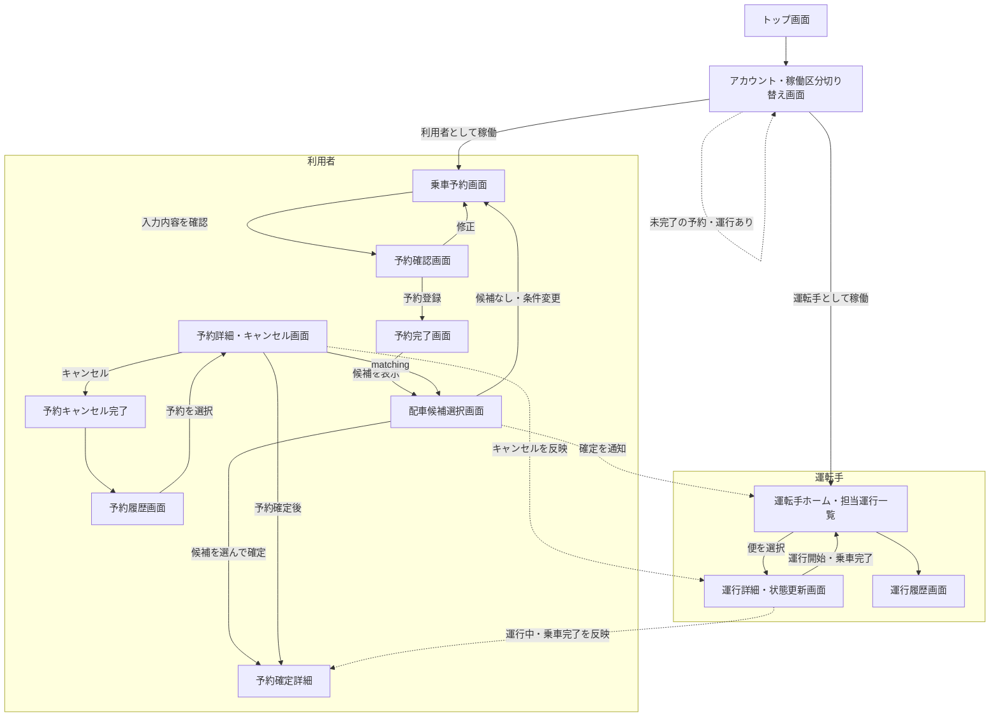
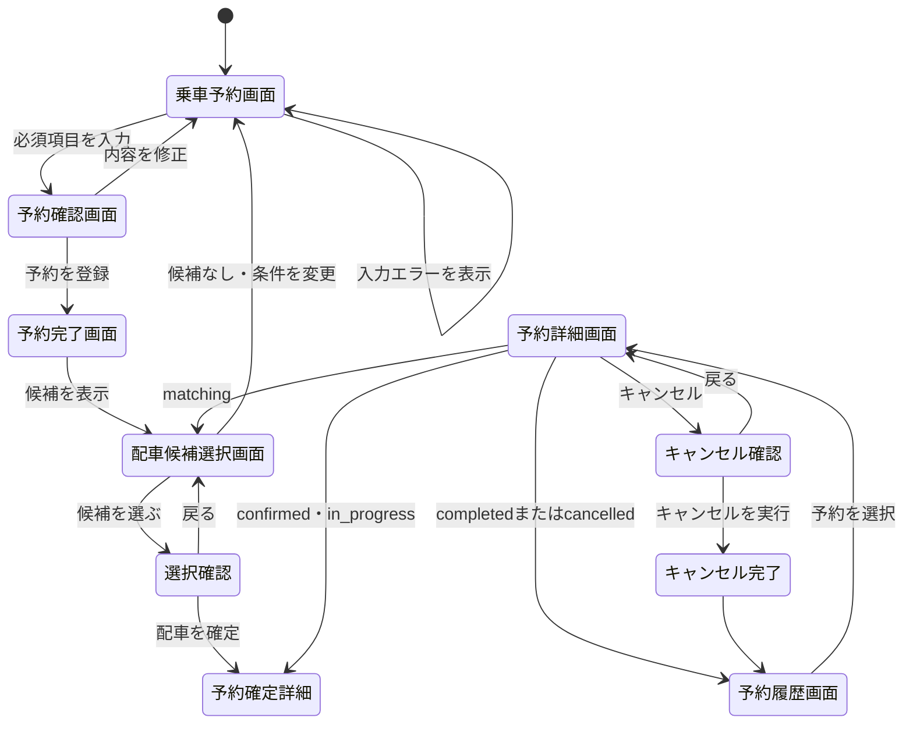
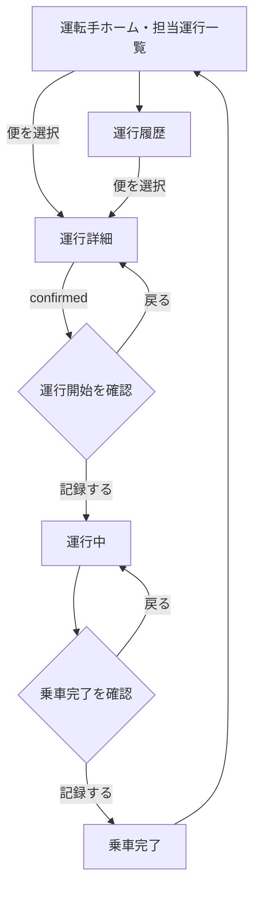

# 画面遷移図

## 概要

利用者向け画面と運転手向け画面の遷移を示す。予約状態と便の状態は、要件定義書の状態定義に合わせている。

1つのアカウントで利用者・運転手の両方を登録できるが、表示されるのは稼働中の区分の画面だけとする。区分は共通の切り替え画面から変更する。

## 全体遷移

## 利用者向け詳細

## 運転手向け詳細

## 遷移ルール

| 遷移元 | 操作・条件 | 遷移先 |
| --- | --- | --- |
| 稼働区分切り替え画面 | 登録済みの区分を選ぶ | その区分のホーム画面 |
| 稼働区分切り替え画面 | 未完了の予約・運行がある | 同じ画面で理由を表示 |
| 乗車予約画面 | 必須項目が正しい | 予約確認画面 |
| 乗車予約画面 | 必須項目不足・形式不正 | 同じ画面でエラー表示 |
| 予約確認画面 | 予約登録 | 予約完了画面（`matching` 状態） |
| 予約完了画面 | 候補作成済み | 配車候補選択画面 |
| 配車候補選択画面 | 候補を選んで確定 | 予約確定詳細（`confirmed` 状態） |
| 配車候補選択画面 | 候補なし | 条件変更の案内、または乗車予約画面 |
| 運行詳細画面 | 運行開始 | `in_progress` 状態 |
| 運行詳細画面 | 乗車完了 | `completed` 状態 |
| 予約詳細画面 | 利用者がキャンセル | `cancelled` 状態 |

## 画面と要件の対応

| 画面 | 主な対応要件 |
| --- | --- |
| アカウント・稼働区分切り替え画面 | FR-U01〜FR-U05 |
| 乗車予約画面 | FR-R01〜FR-R05 |
| 予約確認画面 | FR-R06 |
| 予約完了画面 | FR-R07、FR-R08 |
| 配車候補選択画面 | FR-R10、FR-R11、FR-A01〜FR-A09 |
| 予約詳細・キャンセル画面 | FR-R09、FR-R12〜FR-R14 |
| 予約履歴画面 | FR-R15 |
| 運転手ホーム・担当運行一覧 | FR-D01、FR-D02、FR-D06 |
| 運行詳細・状態更新画面 | FR-D03〜FR-D05 |
| 運行履歴画面 | FR-D07 |
