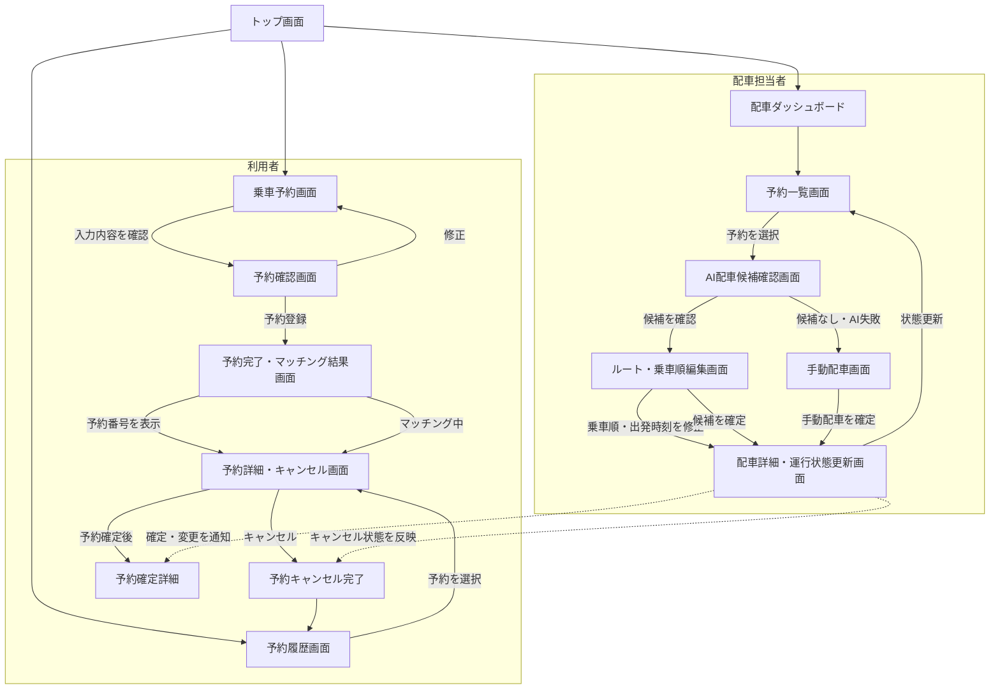
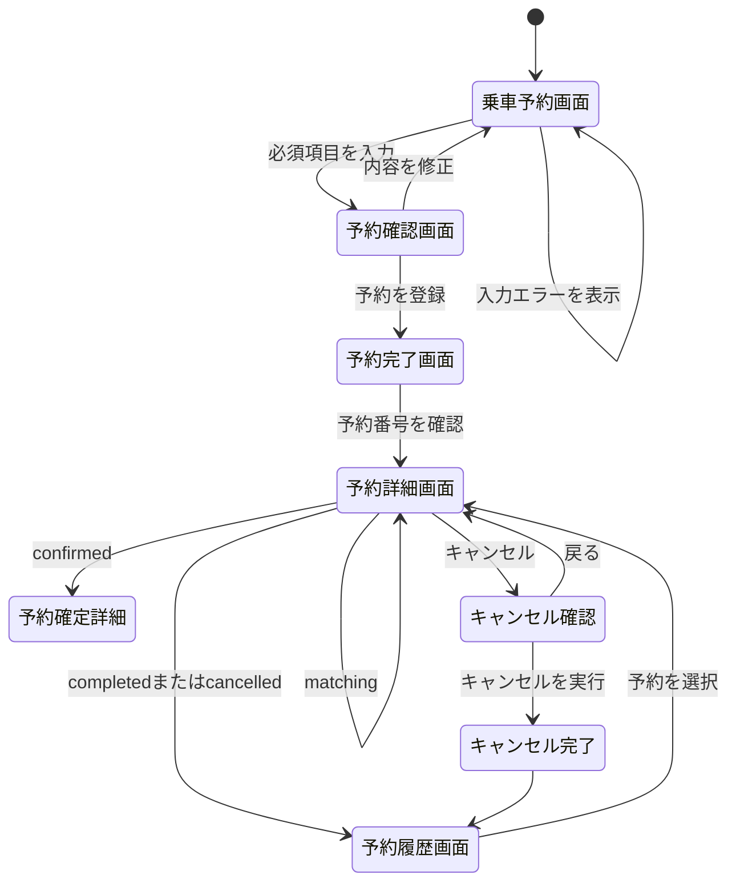
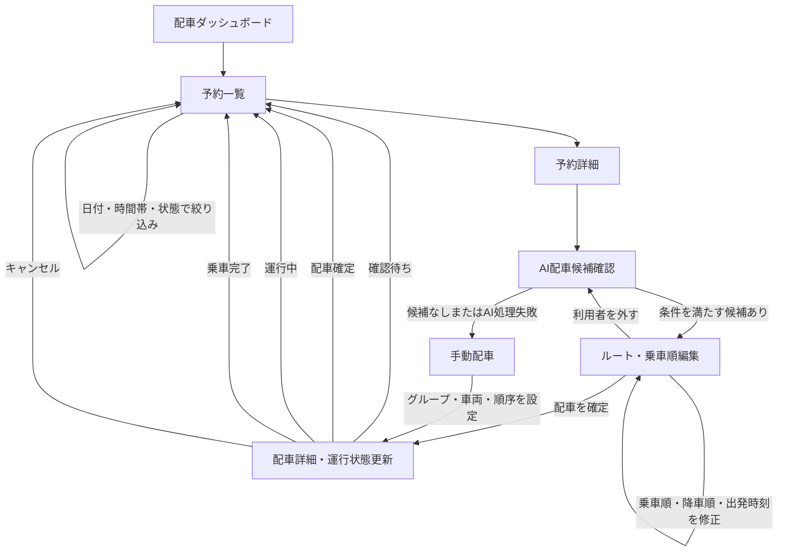

# 画面遷移図

## 概要

利用者向け画面と配車担当者向け画面の遷移を示す。予約状態は、要件定義書の状態定義に合わせている。

## 全体遷移

## 利用者向け詳細

## 配車担当者向け詳細

## 遷移ルール

| 遷移元 | 操作・条件 | 遷移先 |
| --- | --- | --- |
| 乗車予約画面 | 必須項目が正しい | 予約確認画面 |
| 乗車予約画面 | 必須項目不足・形式不正 | 同じ画面でエラー表示 |
| 予約確認画面 | 予約登録 | 予約完了・マッチング結果画面 |
| 予約完了画面 | 登録直後 | `matching` 状態 |
| AI配車候補確認画面 | 候補を確認 | ルート・乗車順編集画面 |
| AI配車候補確認画面 | 候補なし・AI利用不可 | 手動配車画面 |
| ルート・乗車順編集画面 | 配車確定 | `confirmed` 状態 |
| 配車詳細画面 | 運行開始 | `in_progress` 状態 |
| 配車詳細画面 | 運行完了 | `completed` 状態 |
| 利用者・担当者 | キャンセル | `cancelled` 状態 |

## 画面と要件の対応

| 画面 | 主な対応要件 |
| --- | --- |
| 乗車予約画面 | FR-R01〜FR-R05 |
| 予約確認画面 | FR-R06 |
| 予約完了・マッチング結果画面 | FR-R07、FR-R08、FR-R12 |
| 予約詳細・キャンセル画面 | FR-R09〜FR-R11 |
| 予約履歴画面 | FR-R13 |
| 配車ダッシュボード・予約一覧画面 | FR-D01〜FR-D03 |
| AI配車候補確認画面 | FR-D04〜FR-D06、FR-A01〜FR-A08 |
| ルート・乗車順編集画面 | FR-D08、FR-D09、FR-A09 |
| 配車詳細・運行状態更新画面 | FR-D07、FR-D10、FR-D11 |
| 手動配車画面 | 非機能要件 9.3、受入条件 |
