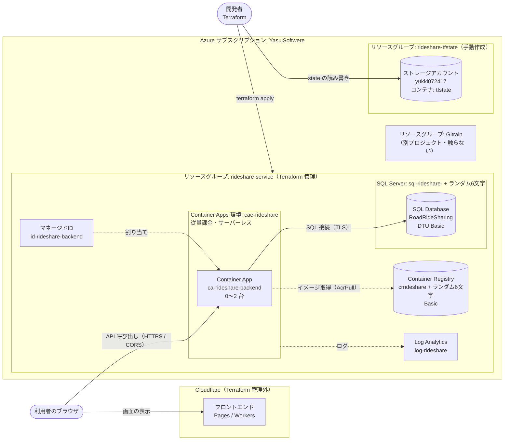
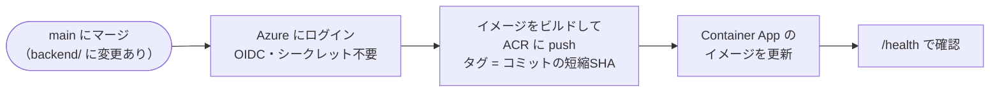

# インフラ（Terraform）

サブスクリプション **YasuiSoftwere** のリソースグループ `rideshare-service` に、バックエンドの本番環境を構築します。フロントエンドは Cloudflare にデプロイし、この Terraform では管理しません。

## インフラ構成



### リソース一覧

| リソース | 名前 | 用途 |
| --- | --- | --- |
| リソースグループ | `rideshare-service` | このプロジェクトのリソースをまとめる（Terraform で管理） |
| Container Apps | `ca-rideshare-backend` | バックエンドAPI（`backend/Dockerfile` のイメージ）。CPU 0.25 / メモリ 0.5Gi、0〜2 台 |
| Container Apps 環境 | `cae-rideshare` | Container Apps の実行環境（従量課金のみ） |
| Container Registry | `crrideshare<ランダム>` | backend イメージの置き場所 |
| Azure SQL Database | `sql-rideshare-<ランダム>` / `RoadRideSharing` | DB（DTU / Basic） |
| Log Analytics | `log-rideshare` | ログ |
| マネージドID | `id-rideshare-backend` | ACR からのイメージ取得（AcrPull） |
| マネージドID | `id-rideshare-github-actions` | GitHub Actions からのデプロイ（OIDC。AcrPush と Container App の更新） |
| リソースグループ | `rideshare-tfstate` | Terraform の state 置き場（手動で作成。Terraform では管理しない） |
| ストレージアカウント | `yukki072417` | state ファイル `tfstate/rideshare.tfstate` を保存 |

SQL の管理者パスワードと JWT の署名鍵は Terraform が生成し、Container App のシークレットとして渡します。

### 設計方針：なるべく安くする

| 対象 | 選択 | 理由 |
| --- | --- | --- |
| Container Apps | **従量課金（Consumption）プランのサーバーレス**、`min_replicas = 0` | アクセスがない間は 0 台になり、課金は実行した分だけ。毎月の無料枠（vCPU 180,000 秒、メモリ 360,000 GiB 秒、リクエスト 200万件）に収まれば実質無料。無料枠はサブスクリプション単位なので Gitrain と共有 |
| Azure SQL | **DTU モデルの Basic**（5 DTU、最大 2GB） | 月額固定でおよそ 5 ドル。vCore のサーバーレスは自動一時停止があるが、最小構成でも Basic より高い |
| Container Registry | Basic | 一番安い SKU |
| Log Analytics | PerGB2018、保持 30 日 | 無料で保持できる範囲 |

補足：

- アクセスがない状態から最初のリクエストでは、コンテナの起動を待つため数秒かかります（コールドスタート）。
- Basic の 5 DTU は MVP 規模を想定しています。足りなくなったら `azurerm_mssql_database.main` の `sku_name` を `S0` などに上げます（DB を作り直さずに変更できます）。
- Azure SQL には無料枠（vCore サーバーレス、月 10 万 vCore 秒）もありますが、使用中の azurerm provider では指定できないため採用していません。

### フロントエンド（Cloudflare）との連携

- フロントエンドの配信は Cloudflare 側で行い、Azure にはフロントエンド用のリソースを作りません。
- フロントエンドと API のドメインが異なるため、**Container Apps の ingress で CORS を許可**します。バックエンドのコードは変更しません。
  - 許可するオリジンは変数 `frontend_origins` で指定します（例：`https://rideshare.pages.dev`）。空の場合は CORS を設定しません。
  - 認証は `Authorization: Bearer` ヘッダーで行い、Cookie は使わないため `allow_credentials` は無効です。
- フロントエンドは API の URL（`terraform output backend_url`）を Cloudflare 側の環境変数などに設定して使います。

### 他プロジェクトと干渉しないための方針

- 管理対象は `rideshare-service` の中だけにする
- state は専用のストレージ（`rideshare-tfstate`）に、専用の key で置く
- provider に `subscription_id` と `tenant_id` を固定し、az CLI の既定サブスクリプションに依存しない
- リソースプロバイダーの登録など、サブスクリプション全体に影響する設定は Terraform で管理しない

## セットアップ方法

Azure 側の準備（手順 1〜3）は [Azure ポータル](https://portal.azure.com) で行います。インフラ本体（手順 4 以降）は Terraform で作ります。

> **ディレクトリの切り替え**
> YasuiSoftwere は既定とは別のディレクトリ（テナント）にあります。ポータル右上の歯車（設定）→「ディレクトリとサブスクリプション」で、YasuiSoftwere が属するディレクトリに切り替えてから作業してください。

### 前提

- Terraform 1.9 以上
- Azure CLI（Terraform の認証と、イメージのビルドに使います）
- YasuiSoftwere サブスクリプションの `Owner` 権限（ロールの割り当てを作るため）

### 1. リソースプロバイダー `Microsoft.Sql` を登録する（初回のみ・済）

1. ポータル上部の検索で「サブスクリプション」を開き、**YasuiSoftwere** を選ぶ
2. 左メニューの「設定」→「リソース プロバイダー」を開く
3. 検索欄に `Microsoft.Sql` と入力して選び、上部の「登録」を押す
4. 状態が「Registered」になるまで数分待つ

登録するだけなので、既存のリソースへの影響はありません。

### 2. state 用のストレージアカウントを作る（初回のみ・済）

1. ポータル上部の検索で「ストレージ アカウント」を開き、「＋作成」を押す
2. 「基本」タブ
   | 項目 | 値 |
   | --- | --- |
   | サブスクリプション | YasuiSoftwere |
   | リソース グループ | 「新規作成」で `rideshare-tfstate` |
   | ストレージ アカウント名 | `yukki072417` |
   | リージョン | (Asia Pacific) Japan East |
   | パフォーマンス | Standard |
   | 冗長性 | ローカル冗長ストレージ (LRS) |
3. 「詳細」タブ
   - 「個々のコンテナーで匿名アクセスを有効にすることを許可する」：**オフ**
   - 「最小 TLS バージョン」：**バージョン 1.2**
4. 「データ保護」タブ
   - 「BLOB の論理的な削除を有効にする」：**オン**（保持期間 7 日）
   - 「BLOB のバージョン管理を有効にする」：**オン**
5. 「確認および作成」→「作成」

作成したら、state を入れるコンテナを作ります。

1. 作成したストレージアカウント `yukki072417` を開く
2. 左メニューの「データ ストレージ」→「コンテナー」→「＋コンテナー」
3. 名前 `tfstate`、匿名アクセス レベル「プライベート」で作成

### 3. 自分に state の読み書き権限を付ける（初回のみ・済）

Terraform は Azure AD 認証（`use_azuread_auth = true`）で state を読み書きするため、アクセスキーではなくロールが必要です。

1. ストレージアカウント `yukki072417` の左メニュー「アクセス制御 (IAM)」を開く
2. 「＋追加」→「ロールの割り当ての追加」
3. 「ロール」で **ストレージ BLOB データ共同作成者**（Storage Blob Data Contributor）を選ぶ
4. 「メンバー」で「ユーザー、グループ、またはサービス プリンシパル」→「＋メンバーを選択する」で自分を選ぶ
5. 「レビューと割り当て」

反映まで数分かかることがあります。

### 4. Terraform を初期化する

```sh
cd infra
cp backend.hcl.example backend.hcl   # 中身はそのまま使える
az login --tenant a45b5a16-0d27-4285-8e28-2d5be8568d98
terraform init -backend-config=backend.hcl
```

#### シークレットを指定する（任意）

SQL の管理者パスワードと JWT の署名鍵は、指定しなければ Terraform がランダムに生成します。
自分で決めた値を使う場合は、ルートの `.env` から `secrets.auto.tfvars` を作ります（`*.auto.tfvars` は Terraform が自動で読み込みます）。

```sh
./scripts/env-to-tfvars.sh
```

| `.env` のキー | Terraform の変数 |
| --- | --- |
| `MSSQL_SA_PASSWORD` | `sql_admin_password` |
| `JWT_SIGNING_KEY` | `jwt_signing_key` |

- `.env.example` と同じ値（リポジトリで公開されているサンプル値）は書き出しません。その項目はランダムな値のままになります
- `secrets.auto.tfvars` は `.gitignore` 済みです。コミットしないでください
- 手で作る場合は `secrets.auto.tfvars.example` をコピーします
- 値を変えて `apply` すると、SQL のパスワードと Container App のシークレットが更新されます。JWT の署名鍵を変えた場合、発行済みのトークンは使えなくなります

### 5. ACR を作ってイメージを入れる

Container App はイメージが無いと起動できないため、先に ACR だけ作ってイメージを入れます。
イメージのビルドとプッシュはポータルからはできないため、ここだけ CLI を使います。

```sh
terraform apply -target=azurerm_container_registry.main
az acr build -r $(terraform output -raw acr_name) -t rideshare-backend:latest --subscription YasuiSoftwere ../backend
```

ビルドしたイメージは、ポータルでコンテナレジストリ →「サービス」→「リポジトリ」→ `rideshare-backend` から確認できます。

### 6. 残りをすべて作る

```sh
terraform apply
terraform output backend_url
```

### 7. 動作を確認する

1. ポータルでリソースグループ `rideshare-service` を開き、`ca-rideshare-backend` を選ぶ
2. 「概要」の「アプリケーション URL」を開き、末尾に `/health` を付けて開き、`"status": "Healthy"` が返ることを確認する（DB に接続できない場合は 503 と `Unhealthy` が返る）
3. 左メニューの「監視」→「ログ ストリーム」で、`Application started.` が出ていれば DB への接続とテーブル作成も成功しています

## 更新

### アプリを再デプロイする（自動）

`main` にマージされると、GitHub Actions（`.github/workflows/deploy-backend.yml`）が自動でデプロイします。



- `backend/` 以下とワークフロー自体の変更だけが対象です。GitHub の Actions タブから手動でも実行できます（workflow_dispatch）
- ログインには Terraform で作ったマネージドID `id-rideshare-github-actions` を使います。`main` ブランチのワークフローだけがログインでき、権限は ACR への push（AcrPush）と `ca-rideshare-backend` の更新だけです
- イメージは GitHub Actions が更新するため、Terraform はイメージの変更を無視します（`lifecycle.ignore_changes`）。インフラの変更は今までどおり手動で `terraform apply` します

手動でデプロイする場合：

```sh
TAG=$(git rev-parse --short HEAD)
az acr build -r $(terraform output -raw acr_name) -t rideshare-backend:$TAG --subscription YasuiSoftwere ../backend
az containerapp update -n ca-rideshare-backend -g rideshare-service --subscription YasuiSoftwere \
  --image $(terraform output -raw acr_login_server)/rideshare-backend:$TAG
```

### フロントエンドのドメインを許可する（CORS）

```sh
terraform apply -var 'frontend_origins=["https://<your-app>.pages.dev"]'
```

設定後は、ポータルで `ca-rideshare-backend` →「設定」→「CORS」から内容を確認できます。

## 注意

- **ポータルから直接変更しない**：`rideshare-service` の中のリソースを手で変更すると、次の `terraform apply` で元に戻されます。変更は tf ファイルで行ってください（`rideshare-tfstate` は Terraform の管理外なので、ポータルで操作して問題ありません）。
- **state の扱い**：state には SQL のパスワードと JWT の署名鍵が平文で入ります。ストレージアカウント `yukki072417` へのアクセス権は最小限にしてください。
- **SQL のファイアウォール**：「Azure サービスからのアクセスを許可」（0.0.0.0）にしています。ローカルから接続したい場合は、ポータルで SQL サーバー →「セキュリティ」→「ネットワーク」→「クライアント IPv4 アドレスを追加する」で一時的に追加し、使い終わったら削除してください。
